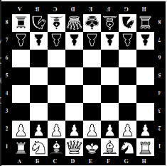

Адаптивная шахматная доска (д/з неделя 6)

Задача: Изменять размерность и цвет шахматной доски в зависимости размера экрана пользователя.

Алгоритм решения:

1. В качестве решения задачи я взял решение домашнего задания 5-й недели.
2. Выделил свойства шахматной доски, которые работают с размерностью, в отдельный миксин.
3. На входе в миксин посылаю делитель, который делит каждое свойство в миксине.
4. Вызаваю миксин три раза для трех разных медиа-запросов, для каждого из которых задаю свой делитель.

Результ:

`@media (min-width: 280px)`

`@media (min-width: 578px)`

`@media (min-width: 900px)`

P.S. Для выделения черных фигур на черном фоне подправил svg - изменил свойства stroke на белый цвет.
